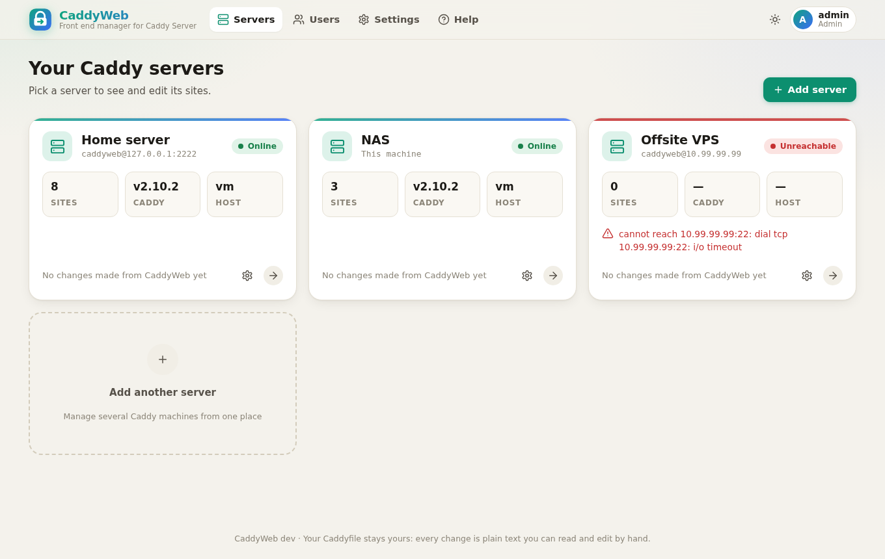
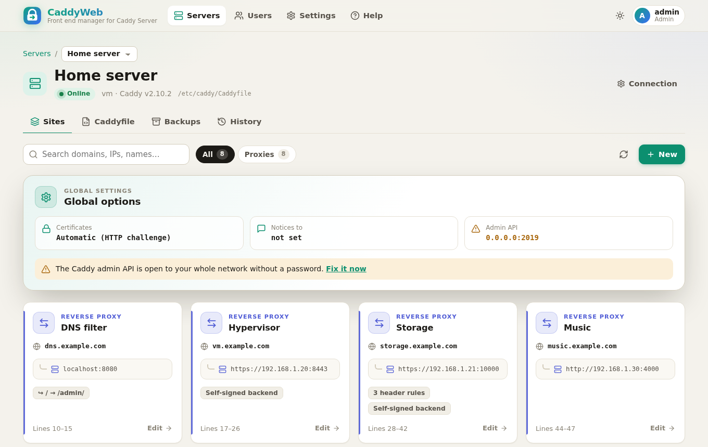
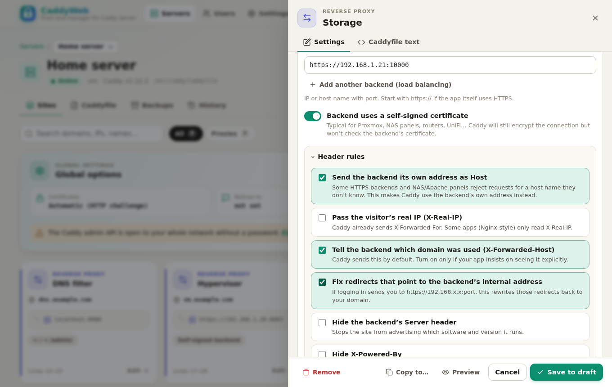
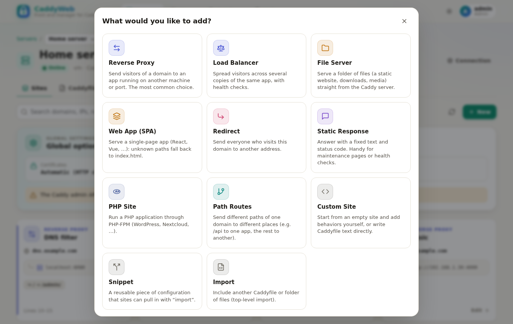
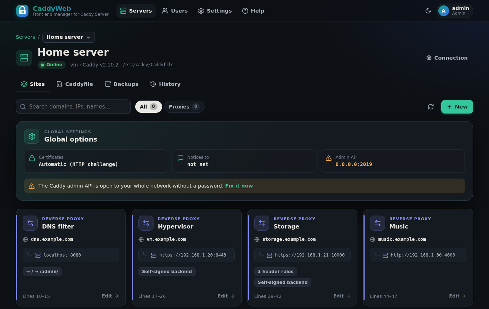
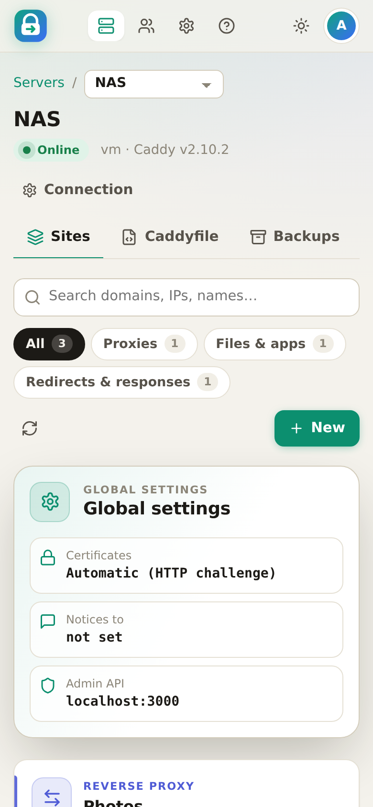

# CaddyWeb

**Front end manager for Caddy Server**

CaddyWeb shows every site in your Caddyfile as a card. Click a card to change
it, press **New** to add a reverse proxy, redirect, file server or anything
else Caddy supports, then press **Apply**. CaddyWeb edits the **real
Caddyfile** — comments and layout included — so you can still open it in
`nano` and see exactly what changed.





| Card editor | Add something new |
|---|---|
|  |  |

| Dark mode | Phone |
|---|---|
|  |  |

## Features

- **Cards for everything** — reverse proxies (with load balancing), file
  servers, single-page apps, PHP sites, redirects, static responses, path
  routes, snippets, imports, and a raw-text escape hatch for anything else.
- **Friendly editors** — header rules with plain-English presets (e.g. *“Fix
  redirects that point to the backend’s internal address”*), self-signed
  backends, password protection, “allow only my LAN”, security headers,
  compression, logs, forward auth… Every card can also be edited as text.
- **Draft → Review → Apply** — see the exact lines that will change. Caddy
  validates first; if it rejects the file you get its message, the line and
  the card, and **nothing on the server changes**. If the reload fails, the
  old file is put back automatically.
- **Backups** — the previous Caddyfile is saved to `/etc/caddy/backups/` on
  every change (you choose how many to keep), mirrored inside CaddyWeb, and
  optionally copied elsewhere with rsync. View, compare, download or restore
  any of them.
- **Multiple Caddy servers** — overview of all servers, one click into each,
  **Copy to server…** for cards.
- **Certificates** — pick your DNS provider (Porkbun, Cloudflare, Duck DNS,
  Namecheap, Route 53, Hetzner, OVH, … 21 built in); CaddyWeb shows which
  plugins your Caddy has and how to add missing ones.
- **Users & roles** — Admin, Power User (can add, can’t change/delete/apply),
  User (read only). Forgotten password? `sudo caddyweb user passwd <name>`.
- **Light & dark themes**, works on phones, no internet or CDN needed.
- **Nothing to lose** — uninstall CaddyWeb and Caddy keeps running with a
  perfectly normal Caddyfile.

## How it works

```
 browser ──► CaddyWeb (:8090) ──SSH──► caddyweb-agent ──► /etc/caddy/Caddyfile ──► caddy reload
             any LAN machine            on each Caddy server
```

Caddy’s admin API can’t save a Caddyfile to disk (changes made through it are
lost on the next restart), so CaddyWeb doesn’t use it. Instead a tiny, readable
bash script — the **agent** — is installed on each Caddy server. CaddyWeb’s
SSH key is locked to that one script: it can read, validate and write the
Caddyfile, manage backups and reload Caddy, and nothing else (no shell, no
port forwarding). Server identities are pinned (trust on first use).

Tip: CaddyWeb also shows a one-click fix if your Caddy admin API is open to
the network (`admin 0.0.0.0:2019`).

## Install

**Step-by-step guide: [docs/INSTALL.md](docs/INSTALL.md)** (written for
non-programmers). In short:

```bash
# 1. on the machine that will run CaddyWeb
curl -fsSL https://raw.githubusercontent.com/mf-ky/caddy-web-interface/main/scripts/install.sh | sudo bash
#    or:  git clone … && cd caddy-web-interface && docker compose up -d --build

# 2. open http://<that-machine>:8090, create your admin account, press "Add a server"

# 3. on each Caddy server, run the command CaddyWeb shows you, e.g.
curl -fsSL http://<caddyweb-machine>:8090/agent/install.sh | sudo bash
```

The same information is in the app under **Help**.

## Command line

```bash
caddyweb serve [--listen :8090] [--data /var/lib/caddyweb] [--tls-cert f --tls-key f]
caddyweb user list | add NAME --role admin|power|viewer | passwd NAME | role NAME ROLE | delete NAME
caddyweb pubkey          # CaddyWeb's SSH public key
caddyweb installer       # print the agent installer
caddyweb version
```

## Development

Go 1.24+, no JavaScript build step (plain ES modules embedded in the binary).

```bash
make test    # vet + unit tests + end-to-end test against real Caddy (if on PATH)
make run     # http://localhost:8090 with data in ./data
make dist    # release binaries for amd64 / arm64 / armv7 / armv6
```

**AI agents and contributors: read [AGENTS.md](AGENTS.md) first** — it
explains the architecture, the invariants that keep your Caddyfile safe, and
how to add directives, DNS providers and API endpoints.
